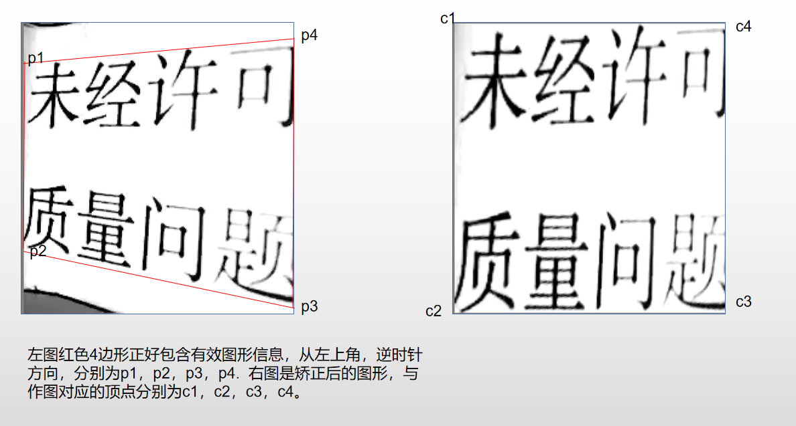

# demo使用方法

四角矫正的示意图如下。




如上图所示，左半部分是原图，右半部分是矫正后的图像。使用demo实现四角矫正，我们只需要输入4组坐标，每组坐标对应矫正前后的坐标偏移量(需要进行归一化)。以上图举例，图片的分辨率是224*240,以图片左下角为原点，得到坐标如下：p1(0,210)、p2(0,55)、P3(224, 7)、P4(224, 225);

以p1为例，矫正后，他的坐标变为（0，240）,则p1的坐标偏移量为(0, 0.25).  x坐标偏移量为0，比较好理解。 y坐标，由210变为240，则y坐标编译量为（240-210）* 2 / 240 = 0.25. 一次计算出四点的坐标偏移量。

```
// 例程中，以60°扫描图片为例，得到四点的坐标偏移量如下(注意坐标顺序，顺序为坐下、左上、右上、右下)。
static GLfloat keystone_vertex[] = {
     0.0f, 0.4583f,  //left bottom
     0.0f, 0.25f,    //left top
     0.0f, 0.133f,   //right top
     0.0f, 0.05f,    //right bottom
 };
```


设置好坐标偏移量，运行例程，就能得到矫正后的结果了。
